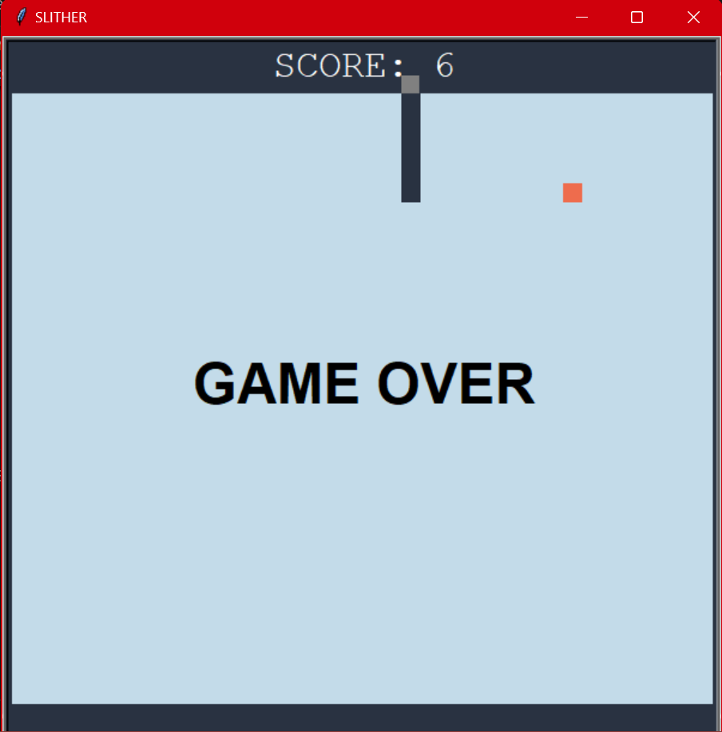

<a id="readme-top"></a>

<div align="center">

  <h1>SLITHER</h1>

  <p align="center">
   A classic Snake game built using Python and the Turtle library.
    <br />

  </p>
</div>

## About The Project

This project is a classic Snake game developed using Python's Turtle library. It was created as a semester project for learning purposes and to practice problem-solving skills.

### Features
- Classic Snake game mechanics
- Score tracking
- Game over detection
- Simple controls for snake movement



### Built With

* 
* 

## Getting Started

### Installation
This is how you can use the code

1. Clone the repo
   ```sh
   git clone https://github.com/mominaamjad/slither-snake-game.git
   ```
2. Install library
   ```sh
   pip install freegames
   ```
### Usage

Run the game:
```sh
python code.py
```

Use the arrow keys to control the snake's direction:

* Right arrow: Move right
* Left arrow: Move left
* Up arrow: Move up
* Down arrow: Move down

<!--README template credits:-->
<!--https://github.com/othneildrew/Best-README-Template -->
